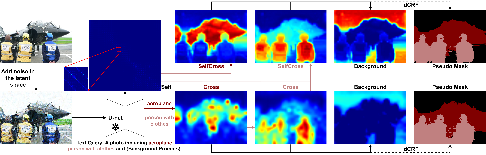

## From Text to Mask: Localizing Entities Using the Attention of Text-to-Image Diffusion Models

This repository contains the official PyTorch implementation of our *Neurocomputing* journal paper:

> **From Text to Mask: Localizing Entities Using the Attention of Text-to-Image Diffusion Models**<br>
> Changming Xiao*, Qi Yang*, Feng Zhou, Changshui Zhang <br>
> https://doi.org/10.1016/j.neucom.2024.128437 <br>
>
>**Abstract:** Diffusion models have revolted the field of text-to-image generation recently. The unique way of fusing text and image information contributes to their remarkable capability of generating highly text-related images. From another perspective, these generative models imply clues about the precise correlation between words and pixels. This work proposes a simple but effective method to utilize the attention mechanism in the denoising network of text-to-image diffusion models. Without additional training time nor inference-time optimization, the semantic grounding of phrases can be attained directly. We evaluate our method on Pascal VOC 2012 and Microsoft COCO 2014 under weakly-supervised semantic segmentation setting and our method achieves superior performance to prior methods. In addition, the acquired word-pixel correlation is generalizable for the learned text embedding of customized generation methods, requiring only a few modifications. To validate our discovery, we introduce a new practical task called "personalized referring image segmentation" with a new dataset. Experiments in various situations demonstrate the advantages of our method compared to strong baselines on this task. In summary, our work reveals a novel way to extract the rich multi-modal knowledge hidden in diffusion models for segmentation.

<div align=center>

</div>

## 1. Reqirements
```
# create conda env
conda env create -f environment.yaml
conda activate ldm

# install pydensecrf from source
git clone https://github.com/lucasb-eyer/pydensecrf
cd pydensecrf
python setup.py install
```

## 2. Preparing Datasets
### PASCAL VOC 2012
Set up PASCAL VOC dataset following [deeplab-pytorch](https://github.com/kazuto1011/deeplab-pytorch/blob/master/data/datasets/voc12/README.md).
The structure of `datasets/VOCdevkit` should be organized as follows:
```
VOCdevkit
└── VOC2012
    ├── Annotations
    ├── ImageSets
    │   ├── Segmentation
    │   └── SegmentationAug
    │       ├── test.txt
    │       ├── train_aug.txt
    │       ├── train.txt
    │       ├── trainval_aug.txt
    │       ├── trainval.txt
    │       └── val.txt
    ├── JPEGImages
    ├── SegmentationObject
    ├── SegmentationClass
    └── SegmentationClassAug
        └── 2007_000032.png
```

### MS COCO 2014
Download MS COCO images from the [official website](https://cocodataset.org/#download).
Download semantic segmentation annotations for the MS COCO dataset at [here](https://drive.google.com/file/d/1pRE9SEYkZKVg0Rgz2pi9tg48j7GlinPV/view?usp=sharing).
The structure of `datasets/COCO` are suggested to be organized as follows:
```
COCO
└── COCO2014
    ├── Annotations
    ├── ImageSets
    │	└── SegmentationClass
    │	    ├── train.txt
    │       └── val.txt
    └── JPEGImages
	├── train2014
	└── val2014
```

## 3. Preparing Pre-trained Models
The Stable Diffusion v1.4 model should be downloaded from [Huggingface](https://huggingface.co/CompVis/stable-diffusion) and be put to `models/ldm/stable-diffusion-v1/` as `model.ckpt`.
The CLIP pre-trained model will be downloaded automatically when running the codes.

## 4. Generate Pseudo Masks
We put the running commands in `run_scripts.sh`.
```
bash run_scripts.sh
```
After running, the generated pseudo masks are saved in `datasets/VOCdevkit/VOC2012/PseudoLabelMysample` or `datasets/COCO/COCO2014/PseudoLabelMysample`.

## 5. Train Segmentation Model
To train DeepLab v2, we refer to [deeplab-pytorch](https://github.com/kazuto1011/deeplab-pytorch). The ImageNet pre-trained model can be found in [AdvCAM](https://github.com/jbeomlee93/AdvCAM).

<!-- ## Citation

If you find our research interesting, please kindly cite our paper:

```
@article{where2edit,
title = {Where you edit is what you get: Text-guided image editing with region-based attention},
journal = {Pattern Recognition},
volume = {139},
pages = {109458},
year = {2023},
issn = {0031-3203},
author = {Changming Xiao and Qi Yang and Xiaoqiang Xu and Jianwei Zhang and Feng Zhou and Changshui Zhang},
}
``` -->